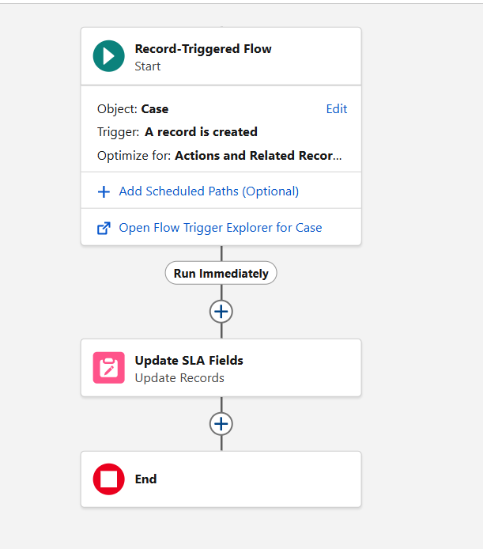
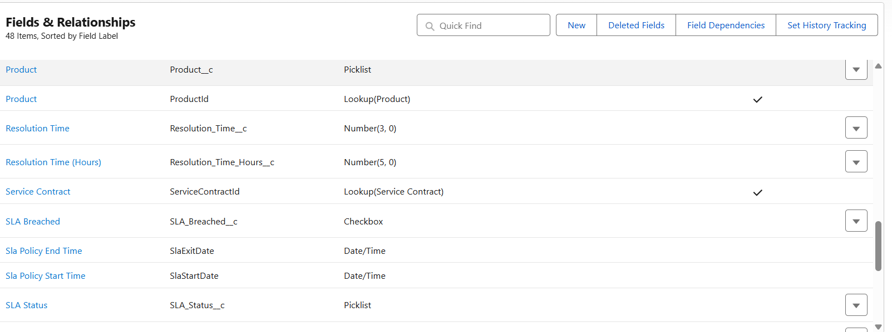
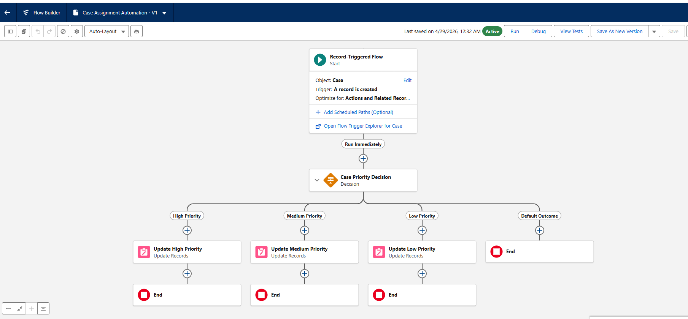
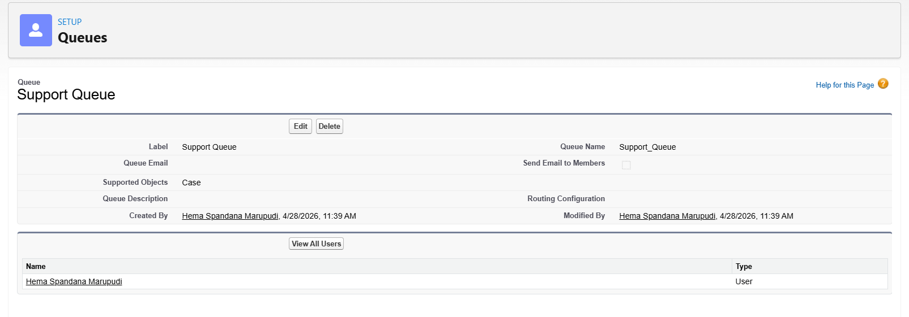
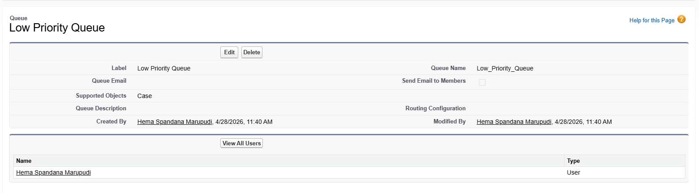
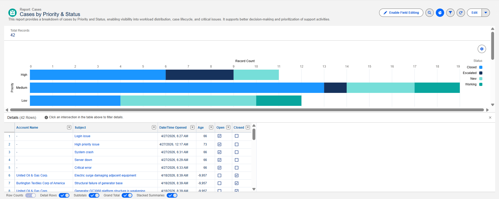
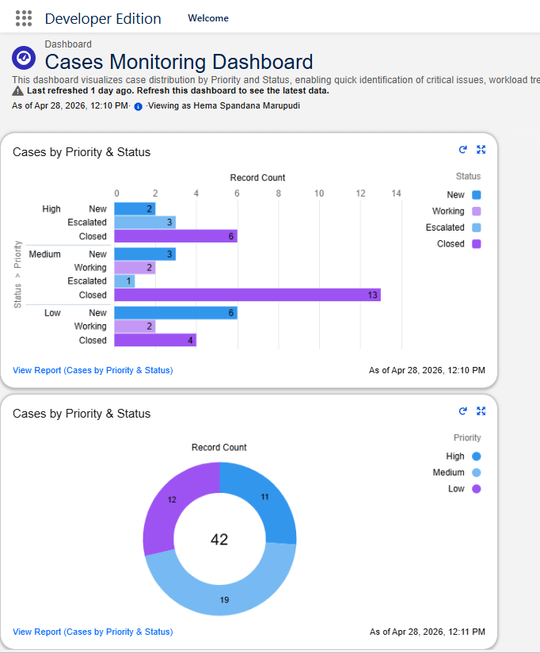

# salesforce-case-management
Salesforce Case Management Automation using Flows, Queues, Reports &amp; Dashboards

# Salesforce Case Management Automation

An end-to-end Salesforce Service Cloud project demonstrating automation, case routing, and analytics using Flows, Queues, Reports, and Dashboards.

---

##  Overview

This project simulates a real-world customer support system where cases are:

* Automatically assigned based on priority
* Tracked using SLA logic
* Analyzed through reports and dashboards

---

## Project Modules

### 1. SLA Automation (Flow-Based)

Automates SLA tracking by updating status and breach flags based on case priority.

**Key Features:**

* Record-triggered flow on Case object
* SLA status updates based on priority (High, Medium, Low)
* Automatic breach flag handling

 Screenshots:

---

###  2. Case Assignment Automation (Queues + Flow)

Automatically routes cases to appropriate queues based on priority.

**Key Features:**

* Priority-based case routing
* Queue configuration for workload distribution
* Reduced manual assignment effort

 Screenshots:

---

###  3. Case Analytics Dashboard

Provides insights into case distribution and performance.

**Key Features:**

* Reports grouped by Priority and Status
* Dashboard visualization using charts
* Real-time monitoring of support workload

 Screenshots:

---

##  Tools & Technologies

* Salesforce Service Cloud
* Salesforce Flow Builder
* Reports & Dashboards

---

## 🎯 Outcome

* Automated case lifecycle management
* Improved response time through intelligent routing
* Real-time visibility into support operations
